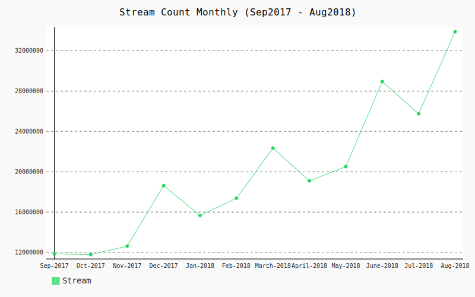
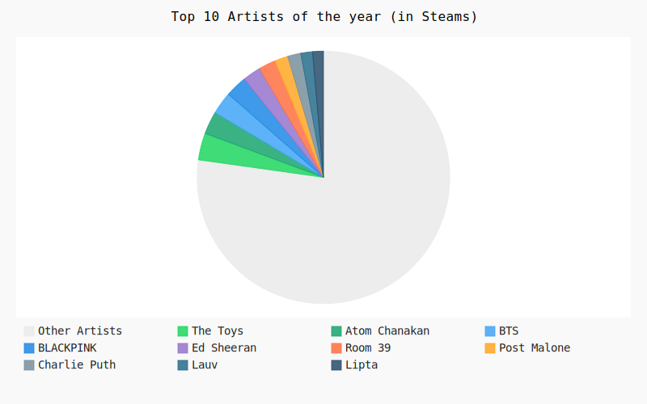
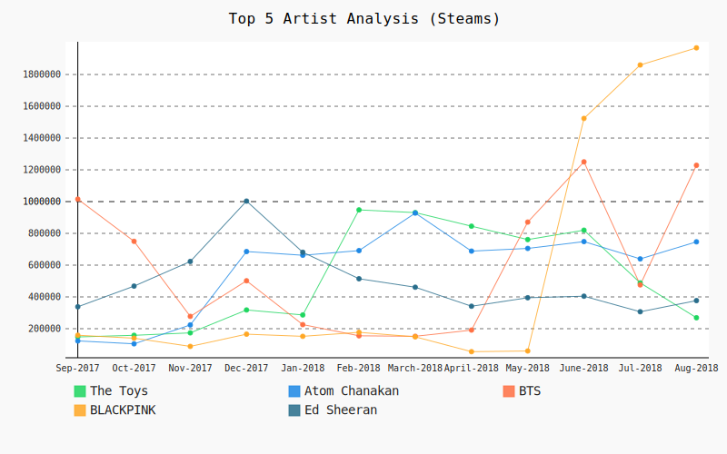
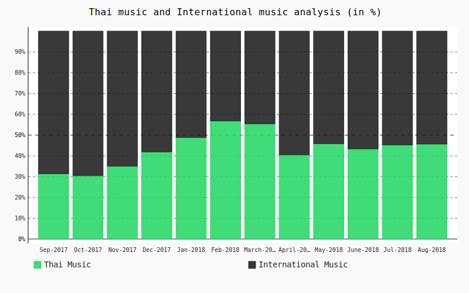

# TopChart Music Analysis
Data Analysis project on www.spotify.com to see Thai people activity on the music

## Objectives
#### Thai music/ International music
People listen to Thai music and International music ratio

#### Stream count monthly
How many people listen to chart music of every month

#### Artist of the month
#### Top 10 Artists of the year

#### Top 5 Artists Analysis
Why this artist is popular

#### Thai music and International music Analysis
Why International music is more popular

## Data Sources
#### [SpotifyCharts - Spotify](https://spotifycharts.com/regional/th/weekly/latest)

## Built-With
* Python `3.7.0`
    * pygal `2.0.0`
